# SEED レンダリングフロー（現行実装）

本ドキュメントは **実コードから確認した現行の 1 フレームのパス構成** を図解する。
フェーズ名・用語は `docs/rendering_roadmap.md` に準拠する（正典はロードマップ側）。

- 主な実装: `runtime/src/engine/core/app_base/app/frame_renderer.rs` の `App::handle_redraw_requested`
- パス開始ヘルパ: `runtime/src/engine/core/renderer/mod.rs` の `begin_*_pass*` 系
- 記載した行番号は調査時点（branch `fix/edit-physics`）のもの。

> 表記ルール: コードで確認できた事実のみを書く。確認できなかった箇所は明示的に **未確認** と書く。

---

## 1. 1 フレームの全体パス構成

以下は `handle_redraw_requested` が **コマンドエンコーダへ記録する順序** である。
（＝GPU 実行順。CPU 側の収集処理は図では省略）

```mermaid
flowchart TD
    A0["フレーム先頭 CPU<br/>入力ポンプ / スクリプトフレーム進行<br/>地形GPU退役 / 地形LODティック"] --> A1
    A1["renderer.begin_frame<br/>get_current_texture"] --> A2
    A2["shadow.prepare_frame<br/>CSM/スポット行列とshadow_index確定"] --> C1

    subgraph COMPUTE["コンピュート段"]
      C1["Skin Compute Pass"] --> C2["Particle Sim Pass<br/>エミッタありのみ"]
      C2 --> C3["Meshlet Cull Pass<br/>対象>0のみ"]
    end

    C3 --> P0

    subgraph PREVIEW["カメラプレビュー描画（Edit・カメラ選択時のみ）"]
      P0["プレビューCSM深度<br/>shadow_preview.record"] --> P1["プレビュー G-Buffer パス"]
      P1 --> P2["プレビュー Deferred ライティング"]
      P2 --> P3["プレビュー フォワード Load パス<br/>skybox / 半透明 / 3Dスプライト"]
    end

    P3 --> S1["シャドウ深度パス<br/>CSM 3枚 + スポット最大4灯"]
    S1 --> S2["RT 加速構造ビルド<br/>BLAS/TLAS・needs_tlas時のみ"]
    S2 --> S3["DDGI プローブ更新 Compute<br/>gi=rt のみ"]
    S3 --> S4["Cluster Build Compute<br/>16x9x24・透視カメラのみ"]

    S4 --> G1

    subgraph GBUF["G-Buffer 段（deferred_active のみ）"]
      G1["G-Buffer パス<br/>不透明のみ MRT x5（+速度）+ 深度"] --> G2["Hi-Z ピラミッド + 遮蔽ディスパッチ<br/>opt-in・結果は次フレーム"]
    end

    G2 --> L1

    subgraph LIGHT["ライティング段（deferred_active のみ）"]
      L1["AO 生成 + いもす法ブラー<br/>ao != off"] --> L2["シャドウマスク生成 + バイラテラル + 時間EMA<br/>RT影 + ソフト影灯あり"]
      L2 --> L3["Deferred ライティングパス<br/>フルスクリーン → scene_hdr"]
      L3 --> L4["SSGI 生成 + ブラー<br/>gi=ssgi・結果は次フレーム使用"]
    end

    L4 --> R1["反射パス + Additive 合成<br/>reflection != off"]
    R1 --> R2["屈折背景ピラミッド生成<br/>refract_active"]

    R2 --> M1

    subgraph MAIN["メインパス（フォワード / 半透明）"]
      M1["begin_scene_pass_load_to（deferred）<br/>または begin_scene_pass_to（forward）"] --> M2["レターボックス帯塗り<br/>Play・Bar系のみ"]
      M2 --> M3["スカイボックス"]
      M3 --> M4["背景ゾーン2Dスプライト"]
      M4 --> M5["不透明フォワード描画<br/>deferred無効時のみ"]
      M5 --> M6["半透明 距離ソート描画<br/>tp_sorted"]
      M6 --> M7["sequential grab 逐次パス<br/>有効時のみパス分割"]
      M7 --> M8["グリッド / アウトライン / スプライト"]
    end

    M8 --> W1

    subgraph WB["WBOIT（tp_wboit のみ）"]
      W1["accum + reveal 蓄積パス"] --> W2["WBOIT 合成 2パス<br/>背景濾過 → 自色加算"]
    end

    W2 --> O1["エディタオーバーレイパス<br/>ギズモ/軸/ワイヤ/アイコン"]
    O1 --> O2["GPU パーティクル描画パス<br/>hdr_view へ Load"]
    O2 --> O3["ブルーム<br/>bloom_enabled"]
    O3 --> O4["トーンマップ → LDR中間<br/>ビネット有効時は前段に挿入"]
    O4 --> O5["キャンバスオーバーレイパス → LDR<br/>scene_canvas_ss のみ"]
    O5 --> O6["present_to_swapchain<br/>FXAA or コピー"]
    O6 --> O7["カメラプレビュー ブリット<br/>右下小窓"]
    O7 --> O8["ID パス<br/>Edit / Pause のみ + ピック読み戻し予約"]
    O8 --> O9["frame.finish<br/>encoder.finish + submit + present"]
```



**図示したパス数（記録される GPU パス）**: コンピュート 3 + カメラプレビュー 4 + シャドウ/RT/DDGI/クラスタ 4 +
G-Buffer/Hi-Z 2 + ライティング段 4（＋各ブラー）+ 反射 2 + 屈折 1 + メイン 1（＋逐次分割）+
WBOIT 3 + オーバーレイ 1 + パーティクル 1 + ブルーム/トーンマップ/キャンバス/present 4 + プレビューブリット 1 + ID 1
= **最大 32 パス前後**（機能フラグとモードで大きく増減する）。

### 重要な順序上の注意（コードで確認）

- **カメラプレビューはメインカメラより「先」に記録される**（`frame_renderer.rs:2147` 付近 vs メイン G-Buffer `:4221`）。
  そのためプレビューは専用の CSM (`draw_ctx.shadow_preview`) と `LightingPass::CameraPreview` の
  BindGroup を使う必要がある（メイン CSM はこの時点で未描画）。ソース走査ユニットテスト
  `camera_preview_pass_uses_preview_lighting_resources`（`frame_renderer.rs:6658`）がこの規約を検査している。
- **WBOIT 合成はエディタオーバーレイより「前」**（`frame_renderer.rs:5062-5073` のコメント）。
  合成は no_depth フルスクリーンクアッドのため、後に置くとギズモを上書きしてしまう。
- **プレビューのブリットは present の「後」**（`:5693`）＝スワップチェーンへ直接貼る。

---

## 2. 各パスの詳細

### 2.1 フレーム先頭処理（CPU）

| 項目 | 内容 |
|---|---|
| 目的 | 入力ポンプ、スクリプトフレーム進行、地形 GPU リソースの遅延退役、地形 LOD ティック |
| 入出力 | GPU パスなし |
| シェーダ | なし |
| 実装 | `frame_renderer.rs:272-303`（`update_gamepad` / `advance_script_frame` / `process_terrain_gpu_retire` / `tick_terrain_lod`） |
| Edit / Play | 差なし。ただし `process_terrain_gpu_retire` は **必ず `begin_frame` より前** に呼ぶ規約（snatch lock 再帰パニック回避、`:274-276` のコメント） |

### 2.2 begin_frame

| 項目 | 内容 |
|---|---|
| 目的 | スワップチェーンテクスチャ取得とエンコーダ生成 |
| 入出力 | 出力: `RenderFrame`（color_view / depth_view / encoder） |
| シェーダ | なし |
| 実装 | `renderer/mod.rs:614` `begin_frame`、呼び出しは `frame_renderer.rs:1133` |
| Edit / Play | 差なし。GPU バックプレッシャーはここに現れる（`perf_begin_frame_ms`） |

### 2.3 Skin Compute / Particle Sim / Meshlet Cull

| 項目 | 内容 |
|---|---|
| 目的 | スキニング（joint 適用）、GPU パーティクルのシミュレーション、LOD0 不透明メッシュレットの可視カリング |
| 入出力 | 頂点/インスタンス/間接コマンドバッファ（ストレージ） |
| シェーダ | `skin_compute.wgsl` / `particle_sim.wgsl` / `meshlet_cull.wgsl` |
| 実装 | `frame_renderer.rs:1445`（Skin, 全バッチで 1 パス共有）/ `:1478`（Particle）/ `:1646`（Meshlet Cull） |
| Edit / Play | 差なし。パーティクルはエミッタ 0 でパスを開かない。メッシュレットカリングは `MULTI_DRAW_INDIRECT_COUNT` 対応 GPU のみ稼働（非対応は `draw_indexed` へ自動フォールバック） |

### 2.4 カメラプレビュー（Edit 専用）

| 項目 | 内容 |
|---|---|
| 目的 | 選択中のカメラアクターの映像を小窓に出す。**本番と同じ Deferred 経路**で描く（旧フォワード小窓は撤去済み） |
| 入出力 | 出力: `preview.gbuffer_views[0..3]` + `preview.depth_view` → `preview.color_view` |
| シェーダ | `gbuffer_write.wgsl` / `terrain_gbuffer_write.wgsl` / `grass_gbuffer.wgsl` → `deferred_lighting.wgsl`（rt_off 版）→ `skybox.wgsl` / `shader_transparent.wgsl` / `sprite.wgsl` |
| 実装 | プレビュー CSM `:2072`、G-Buffer `:2147`（`begin_gbuffer_pass_to_depth`）、ライティング `:2216`（`begin_deferred_lighting_pass_to`）、フォワード Load `:2236`（`begin_offscreen_load_pass`）、ブリット `:5693`（`begin_blit_pass`） |
| Edit / Play | **Edit のみ**（`is_3d_scene = in_editor && !use_ortho_2d_camera`、`in_editor = mode==Edit \|\| paused`、`:458`）。かつ `selected_cam_data` が Some のとき（`:1805`）。Play では描かれない |
| 制限 | AO / SSGI / RT 影 / シャドウマスクは無効（ダミー供給）。クラスタは `ClusterParams.enabled=0`（全ライト線形走査）。`view_mode` は Lit 固定。メッシュレットカリングは使わない（間接コマンドがメインカメラ基準のため） |

### 2.5 シャドウ深度パス

| 項目 | 内容 |
|---|---|
| 目的 | 方向光 CSM 3 カスケード＋スポット最大 4 灯の深度描画 |
| 入出力 | 出力: `dir_tex`（`Depth32Float` の 3 レイヤ配列, 2048x2048）、スポット 1024x1024 |
| シェーダ | `depth_prepass.wgsl`（深度のみ）。読み取り側は `shadow.wgsl`（group4 binding2..5） |
| 実装 | 行列準備 `frame_renderer.rs:1157`（`shadow.prepare_frame`）、深度記録 `:3942`（`shadow.record`）。定数は `renderer/shadow.rs:43-54`（`CSM_CASCADE_COUNT=3` / `SHADOW_MAP_SIZE=2048` / `SPOT_SHADOW_SIZE=1024` / `MAX_SHADOW_SPOTS=4` / `CSM_SPLIT_LAMBDA=0.5`） |
| Edit / Play | 差なし（キャスターが 0 なら 0 コストでスキップ）。ただし CSM はカメラ固有のため Edit ではデバッグカメラ基準。散布モデル（`kind=Model` プロップ）もキャスターに含む |

### 2.6 RT 加速構造ビルド（BLAS / TLAS）

| 項目 | 内容 |
|---|---|
| 目的 | RT 影 / RT-GI / RT 反射 / RT 屈折 が使う TLAS の構築 |
| 入出力 | 出力: TLAS・BLAS キャッシュ・アルベドバッファ（DDGI / RT 反射と共有） |
| シェーダ | なし（`build_acceleration_structures`） |
| 実装 | `frame_renderer.rs:3965`（ゲートは `draw_ctx.rt_shadow.is_some() && resolved_features.needs_tlas()`）、実体は `renderer/rt_shadow.rs:333` `prepare_and_build` |
| Edit / Play | 差なし。散布モデルは `"scatter://{model_path}"` キーで BLAS 共有。`MAX_RT_INSTANCES=4096` 超は警告付きクランプ |

### 2.7 DDGI プローブ更新 Compute

| 項目 | 内容 |
|---|---|
| 目的 | プローブ格子の八面体アトラス（放射輝度＋可視性）をローテーション更新 |
| 入出力 | 出力: `GI_ATLAS_FORMAT = Rgba16Float` の放射輝度アトラス(8x8) と可視性アトラス(16x16) |
| シェーダ | `ddgi_common.wgsl` + `ddgi_probe_update.wgsl`（`EXPERIMENTAL_RAY_QUERY` 必須） |
| 実装 | `frame_renderer.rs:4094-4097`（`gi_on = draw_ctx.gi.is_attached() && resolved_features.rt_gi()`）、`renderer/ddgi/mod.rs:76,91-99` |
| Edit / Play | 差なし。`GiParams` は毎フレーム書き込む（`gi_on=false` のときは `enabled=0` を書きフラットアンビエントへ戻す）。SSGI の場合は compute 不要 |

### 2.8 Cluster Build Compute（クラスタードライティング）

| 項目 | 内容 |
|---|---|
| 目的 | メインカメラ視錐台を 3D フロクセルへ分割し、各クラスタへ影響する局所ライト（point/spot/rect）のインデックスを集める |
| 入出力 | 出力: `grid_buffer`（`array<ClusterCell>` = offset/count）、`indices_buffer`（`array<u32>`）、`cursor_buffer`（atomic。毎フレーム 0 クリア） |
| シェーダ | `cluster_build.wgsl`（共有定義 `cluster_common.wgsl`）。消費側は `lighting_eval.wgsl` |
| 実装 | `frame_renderer.rs:4142-4176`、定数は `renderer/clustered.rs:42-70` |
| 構成 | `CLUSTER_TILES_X=16` / `CLUSTER_TILES_Y=9` / `CLUSTER_SLICES_Z=24`（指数分割）= `CLUSTER_COUNT=3456`、`MAX_LIGHTS_PER_CLUSTER=256`、ワークグループ `4x4x4` |
| Edit / Play | タイル分割の正規化に使う矩形が違う。Play（非 Pause）は `game_viewport`、それ以外は `(0,0,win_w,win_h)`（`:4148-4152`）。正射／2D オルソカメラでは `saved_shadow_cam` が None になり `cluster_on=false`（全ライト線形走査へフォールバック） |

### 2.9 G-Buffer パス

| 項目 | 内容 |
|---|---|
| 目的 | **不透明 Lit ジオメトリのみ** を 5 枚の MRT ＋深度へ焼く |
| 入出力 | 出力: `gbuffer0..3` + `gbuffer_velocity` + 共有深度 |
| シェーダ | `gbuffer_write.wgsl`（メッシュ/スキン）、`terrain_gbuffer_write.wgsl`（地形 triplanar レイヤブレンド）、`grass_gbuffer.wgsl`（プロシージャル草）。頂点は G-Buffer 専用の `gbuffer_static_vertex.wgsl` / `gbuffer_skinned_vertex.wgsl`（フォワードと共有の `shader_*_vertex.wgsl` ではない）。速度の共有定義は `velocity_math.wgsl`（純関数）と `velocity_common.wgsl`（group4 の前フレーム行列） |
| 実装 | `frame_renderer.rs:4221`（`begin_gbuffer_pass_to`）、パイプラインは `renderer/gbuffer.rs`、描画は `gbuffer::draw_gbuffer_indirect` |
| ゲート | `deferred_active = post_fx.deferred && !edit_view_2d && !scene_wireframe && scene_is_lit`（`:3681`） |
| Edit / Play | Play では `game_viewport` の viewport/scissor を適用（帯外にジオメトリを焼かない、`:4225-4230`）。Edit のワイヤーフレーム表示・2D シーンビューは `deferred_active=false` になりフォワードへ落ちる。`scene_is_lit` は Play では常に true、Edit ではシーンビュー表示モードに従う |
| カリング | 視錐台外・遠方の地形チャンク（`terrain_culled`）はスキップ |

#### G-Buffer レイアウト

| RT | 定数 | フォーマット | 格納内容 |
|---|---|---|---|
| g0 | `GBUFFER0` | `Rgba8Unorm` | `rgb` = albedo（リニア）、`a` = occlusion |
| g1 | `GBUFFER1` | `Rgba16Float` | `xyz` = ワールド法線（シェーディング法線）、`w` = authored 法線フラグ（0＝深度復元 Ng を使う、1＝草・地形など信頼できる法線を使う） |
| g2 | `GBUFFER2` | `Rgba8Unorm` | `r` = metallic、`g` = roughness、`b` = diffuse_transmission、`a` = **user_data**（マテリアルの汎用ユーザーデータ 0..1・8bit） |
| g3 | `GBUFFER3` | `Rgba16Float` | `rgb` = emissive（HDR）、`w` = **surface_id**（下位 4bit = セマンティックタグ / 続く 2bit = シェーディングモデル ID） |
| g4 | `GBUFFER_VELOCITY` | `Rg16Float` | `rg` = **スクリーンスペース速度**（モーションベクタ）。前フレーム→今フレームの移動量をビューポート正規化 UV で表す（ピクセル単位が要るならビューポートの幅・高さを掛ける）。定義の正典は `shaders/velocity_math.wgsl` の `compute_velocity_uv` |
| depth | `DEPTH_FORMAT` | `Depth24PlusStencil8` | `depth_write_enabled: true` / `CompareFunction::Less`。ライティング側は `texture_depth_2d` を `textureLoad` のみで読み、`inv_view_proj` でワールド座標を復元 |

- フォーマット定義: `renderer/gbuffer.rs:38-44`、深度は `renderer/mod.rs:132`、パイプラインの depth_stencil は `gbuffer.rs:215-224`
- 書き込み側の権威: `shaders/gbuffer_write.wgsl`（`GBufferOut` / `fs_gbuffer`）
- 読み出し側: `shaders/deferred_lighting.wgsl`（`GBUFFER_NORMAL_AUTHORED_THRESHOLD` で g1.w を分岐、g2.a / g3.a を `Surface` へ復元）

#### g4（速度＝モーションベクタ）— 第2層の生成物

将来の TAA / モーションブラー、および L3（合成アセット）の入力素材。
**現時点で消費者はいない**（「正しく生成され、バインド可能である」ことまでが実装スコープ）。

| 項目 | 内容 |
|---|---|
| 値 | `curr_uv - prev_uv`（ビューポート正規化 UV・符号付き・`±1.0` でクランプ） |
| 生成方式 | **頂点再投影**。G-Buffer の頂点シェーダが今フレームのクリップ座標と「前フレーム行列で再投影したクリップ座標」の 2 本を渡し、フラグメントが透視除算して差を取る |
| 静的ジオメトリ | 前フレームのインスタンス行列が今フレームと一致する（＝`prev_model == model`）ため、式が自動的に「カメラ由来の速度」へ縮退する。**深度からのフルスクリーン再投影パスは持たない** |
| 動的オブジェクト | インスタンスごとの前フレームモデル行列（group4 の `PrevModelUniform`）で再投影する |
| スキンメッシュ | **剛体ぶんのみ**（アクタの移動・回転）。ボーン変形ぶんは含まない。理由とコストは `gbuffer_skinned_vertex.wgsl` 冒頭を参照 |
| 地形 / 草 | 静的扱い（カメラ由来のみ）。草の風の揺れは意図的に速度へ含めない（毎フレーム位相が変わる高周波変形で、含めると TAA の履歴が常に破棄される） |
| カメラプレビュー | 速度不要。専用の捨て RT へ書き、プレビューカメラの uniform は `prev_view_proj = view_proj` 固定（＝値は恒等的に 0） |
| デバッグ表示 | `SEED_DEBUG_VELOCITY=1` で疑似カラー可視化（灰色=速度0 / 赤・シアン=水平 / 緑・マゼンタ=垂直 / 青=飽和）。ブルーム／トーンマップ直前に全面上書きする |

**「静的は深度から一括、動的は個別に」としなかった理由**: 動的オブジェクトは G-Buffer パスで
個別に速度を書く必要がある。そこへ静的用のフルスクリーン再投影パスを足すと、
「動的物が既に書いた画素を塗り潰さない」ためのマスク（ステンシル等）が要り、
なおかつ同じ画素の速度を 2 度計算することになる。頂点再投影に一本化すれば
静的・動的が同じ 1 式で完結し、追加パスもマスクも二重計算も発生しない。

**速度が爆発しない設計（境界条件）**:

| 状況 | 対処 | 実装 |
|---|---|---|
| 初回フレーム | `prev_view_proj = view_proj` / `prev_model = model` | `velocity_prev_view_proj: Option` の初期値 `None`、`InstancedModelBatch::velocity_reset` の初期値 `true` |
| Play⇄Edit 切替・ポーズ切替・RT リサイズ・ワールドライン切替 | 連続性キー `(Play か, ポーズか, RT 幅, RT 高さ, ワールドライン)` の変化を検出して自動リセット | `frame_renderer.rs` の `velocity_key`。バッチ側へは `request_velocity_reset()` で伝播する |
| シーンロード／シーン遷移 | 明示リセット | `App::request_velocity_reset()`（`self.scene = Some(..)` の直後で呼ぶ） |
| カメラのテレポート | 同上（明示リセット） | 同上 |
| インスタンス数の変化・バッチ再生成 | 前フレームキャッシュの長さ不一致で自動リセット | `InstancedModelBatch::update` の `prev_usable` 判定 |
| 地形 LOD チャンク差し替え | **そもそも爆発しない**。差し替わるのはメッシュであってインスタンス行列ではなく、かつ本方式は「**今フレームの**頂点を前フレームの行列で再投影する」ため、前フレームの頂点位置を参照していない | 構造上 |
| 散布モデル（草・プロップ）の可視リスト入れ替え | 静的なので毎フレーム `request_velocity_reset()`（prev=curr が厳密に正しい） | `terrain_scatter_ops.rs` |

> **残存リスク**: 統合バッチのインスタンス列が「本数は同じまま並びだけ入れ替わる」ケース
> （同一フレームでのアクタ追加と削除が相殺する等）は自動検出できず、1 フレームだけ
> 誤った速度が出る。必要なら `App::request_velocity_reset()` を明示的に呼ぶこと。

**コスト**:

| 項目 | 増分 |
|---|---|
| VRAM（速度 RT） | 4 byte/px（1920×1080 で約 8.3 MB） |
| VRAM（前フレーム行列バッファ） | 現行インスタンスバッファの **+50%**（1 エントリ 64 byte ＝ `ModelUniform` 128 byte の半分） |
| 毎フレーム転送 | 同上 +50%（可視インスタンス × メッシュノード × 64 byte） |
| CPU メモリ | 64 byte × インスタンス数 × メッシュノード数（前フレーム行列キャッシュ） |
| 頂点→フラグメント補間 | 8 float（クリップ座標 2 本）。`VertexOutput` は共有なのでフォワード系にも乗る |
| MRT byte cost | 32 → 36。**wgpu 既定の `max_color_attachment_bytes_per_sample`（32）を超える**ため、`renderer/mod.rs` がデバイス生成時にアダプタ実値（DX12/Vulkan では 8×16 = 128）へ引き上げている |

> **注意（見落としやすい点）**: WebGPU の byte cost は チャンネル実サイズではなく
> **フォーマットごとの固定表**で数え、4 チャンネル形式は 8bit でも 16bit でも一律 8。
> つまり速度追加前の G-Buffer 4 枚だけで既に 8+8+8+8 = 32 と既定リミット丁度だった。
> MRT を足す変更では必ずこのリミットを確認すること
> （回帰ガード: `gbuffer.rs` の `gbuffer_mrt_byte_cost_matches_formats_and_requires_raised_limit`）。

#### 情報系チャンネル（g2.a / g3.a）

「表面の物性」ではなく「この点は何なのか」を運ぶチャンネル。
合成（第3層）が読むための素材として第1層が申告する。

> **更新（L3-a 実装済み）**: このうち `shading_model` は**実際に第3層で消費されるようになった**。
> deferred ライティングの `lighting_eval.wgsl` が `ShadingSurface.shading_model` を
> 契約関数 `shade_surface` の `switch` キーとして使い、ID 1..3 をシェーディングアセットの
> ユーザー実装へ振り分ける（詳細は `docs/shading_asset.md`）。**ID 0 もアセットが
> `shade_default` を定義していればそちらへ回る**ため、この値を設定していないマテリアル
> （＝ほぼ全て。地形・草を含む）もアセットの影響下に入る。`render_tag` / `user_data` は
> 依然どのライティング経路からも参照されず、アセット側が任意に読める素材にとどまる。

| 値 | 宣言場所 | 粒度 | 格納先 | 精度 |
|---|---|---|---|---|
| `render_tag`（セマンティックタグ） | `ModelComponent::render_tag`（`.scene` に保存） | **アクタ単位** | g3.a の下位 4bit | 16 種（0 = タグ無し） |
| `shading_model`（シェーディングモデル ID） | `Material::shading_model`（`.smdl`/`.mat` に保存） | マテリアル単位 | g3.a の続く 2bit | 4 種（0 = 既定。アセットの `shade_default` が無ければエンジン標準 PBR、あればそちら。1..3 はシェーディングアセットが例外用に定義） |
| `user_data`（汎用ユーザーデータ） | `Material::user_data`（同上） | マテリアル単位 | g2.a | 8bit＝1/255 刻み（0..1） |

- ビット規約の単一の真実source: `renderer/surface_id.rs`（Rust）と `shaders/surface.wgsl` の
  `pack_surface_id` / `unpack_surface_id`（WGSL）。両者の一致は `surface_id.rs` のユニットテストが固定する。
- `g3.a` は `Rgba16Float`。half float は整数 2048 まで誤差ゼロで表現できるため、パック値（最大 63）は
  **完全に無損失**で往復する。使用は 6bit のみで、無損失域の残り 5bit が将来用に空いている。
- **新規 MRT を足していない**。棚卸しの結果 g2.a / g3.a が唯一の完全な空きチャンネルであり、
  そこへ詰めたので G-Buffer の帯域増加はゼロ・既存チャンネルの精度低下もゼロ。
- `render_tag` の配管は `ModelUniform.normal_matrix` の **4 列目**（法線変換は常に `w=0` の
  ベクトルに掛かるため数学的に寄与しない 16 byte）を「インスタンス拡張スロット」として転用する。
  `ModelUniform` は 128 byte のまま＝全インスタンス×全ノードの毎フレーム転送量は 1 byte も増えていない。
- 地形（`terrain_gbuffer_write.wgsl`）・草（`grass_gbuffer.wgsl`）は両チャンネルに 0 を書く
  （＝タグ無し・DefaultPBR・user_data 0。既定値と一致するので合成側の分岐は不要）。

### 2.10 Hi-Z オクルージョン（opt-in）

| 項目 | 内容 |
|---|---|
| 目的 | 地形チャンクの world AABB を Hi-Z 深度へ投影・比較して完全遮蔽チャンクを求める |
| 入出力 | 入力: G-Buffer 深度。出力: 可視性バッファ → staging（**次フレーム** の `try_read_results` が受け取る 1 フレーム遅延） |
| シェーダ | `hiz_copy_depth.wgsl` / `hiz_gen_mip.wgsl` / `hiz_occlusion.wgsl` |
| 実装 | `frame_renderer.rs:4360-4392`（`build_pyramid` / `dispatch_occlusion` / `schedule_readback`）、submit 後のマップ予約は `:6192` `map_after_submit` |
| ゲート | 環境変数 `SEED_OCCLUSION_CULL=1`（`terrain_scatter_ops::HIZ_OCCLUSION_ENABLED`、`terrain_scatter_ops.rs:281`）のときのみ、かつ deferred のみ、かつ `readback_idle()` のフレームのみ |
| Edit / Play | 差なし。結果が無いチャンクは「不明なら描く」保守側 |

### 2.11 AO 生成パス

| 項目 | 内容 |
|---|---|
| 目的 | 半解像度 AO を焼き、いもす法で均す。ライティングは occlusion に乗算（アンビエント/DDGI/バウンスのみに効く） |
| 入出力 | 入力: G-Buffer + 深度（+ RT-AO なら TLAS）。出力: `ao_raw` → いもす法 → `ao_b`（`AO_FORMAT = IMOS_BLUR_FORMAT`。`.r` のみ使用） |
| シェーダ | `ao_common.wgsl` + `ao_ssao.wgsl`（SSAO）または `ao_rt.wgsl`（RT-AO）、ブラーは `imos_blur.wgsl` |
| 実装 | `frame_renderer.rs:4422`（`begin_ao_pass_to`）、`:4436`（`ao_p.blur`）、`renderer/ao.rs:44,98-100,157,165` |
| ゲート | `ao_effective != Off`。`ao_effective` は `deferred_active` のときのみ `resolved_features.ao`（`:3693-3698`）。RT-AO は `ao==Rt && ao_p.rt.is_some()` のときのみ、それ以外は SSAO へ安全側フォールバック |
| Edit / Play | 差なし（半解像度・UV ベースのため viewport 適用なし） |

### 2.12 シャドウマスク生成パス

| 項目 | 内容 |
|---|---|
| 目的 | RT ソフト影のディザ状ノイズ対策。選定した最大 4 灯について `rt_shadow_factor` を半解像度で評価しマスク化・デノイズする |
| 入出力 | 出力: 半解像度 `texture_2d_array`（`Rgba16Float`、レイヤ＝スロット）。`.rgb` = 透過率、`.a` = half-res ビュー空間深度（バイラテラルのガイド） |
| シェーダ | `shadow_mask.wgsl`（内部で `rt_shadow_on.wgsl` を連結）、デノイズは `shadow_mask_bilateral.wgsl` の `blur_cs` コンピュート |
| 実装 | `frame_renderer.rs:4475`（`begin_shadow_mask_pass_to`）、`:4498`（`smp.blur`）、`renderer/shadow_mask.rs:1-63`、`renderer/shadow_mask_bilateral.rs:63,112` |
| ゲート | `shadow_mask_active = deferred_active && rt_on && !shadow_mask_selection.is_empty() && pipelines.shadow_mask.is_some()`（`:3796`）。上限（`RT_SHADOW_MASK_LIGHTS=4`）を超える灯は `lighting_eval.wgsl` からインラインで `rt_shadow_factor` を評価する |
| Edit / Play | 差なし |

### 2.13 Deferred ライティングパス

| 項目 | 内容 |
|---|---|
| 目的 | G-Buffer からフルスクリーンで PBR ライティングを復元し HDR シーンへ書く |
| 入出力 | 入力: g0..g3 / depth / AO(`ao_b`) / SSGI(前フレーム `ssgi_b`) / シャドウマスク(`hist[cur]`＝バイラテラル＋時間 EMA の結果) / ライト・CSM・クラスタ・DDGI。出力: `RT_SCENE_HDR`（`Rgba16Float`） |
| シェーダ | `deferred_lighting.wgsl`（`fs_deferred`）。連結順は `cluster_common.wgsl` + `pbr_common.wgsl` + `ddgi_common.wgsl` + `light_common.wgsl` + `shadow.wgsl` + `rt_shadow_off.wgsl` または `rt_shadow_on.wgsl`(+`rt_shadow_tint_avg.wgsl` / バインドレス版は `bindless_common.wgsl`+`rt_shadow_tint_bindless.wgsl`) + `surface.wgsl` + `lighting_eval.wgsl` + `deferred_lighting.wgsl` |
| 実装 | `frame_renderer.rs:4538`（`begin_deferred_lighting_pass_to`）、パイプラインは `renderer/deferred.rs`（`:310-321` / `:336-348` / `:146-150` に連結のユニットテストあり） |
| Edit / Play | Play では `game_viewport` の viewport/scissor を適用（`:4539-4543`）。`view_mode`（シーンビュー表示モード）は Edit のみ有効で Play は Lit 固定（`:970-980` 付近の `scene_view_mode_code`） |

#### group1（G-Buffer 入力）バインディング — `deferred.rs:251-297`

| binding | 内容 |
|---|---|
| 0-3 | g0 / g1 / g2 / g3 |
| 4 | depth（DepthOnly aspect） |
| 5 | G-Buffer サンプラー |
| 6,7 | AO ビュー（AO=Off なら白 1x1）、linear サンプラー |
| 8,9 | SSGI ビュー（未収束ならダミー）、linear サンプラー |
| 10,11 | シャドウマスク配列（非対象ならダミー白）、linear サンプラー |

group0 = カメラ、group4 = ライト複合（`light_common.wgsl` 由来。RT バリアントは TLAS を binding6、平均アルベドを binding14 に含む）、group3 = バインドレス色付き影（対応 GPU のみ）。
反射は **別のフルスクリーンパイプライン** であり group1 には含まれない（加算合成で後から重ねる）。

### 2.14 SSGI 生成パス

| 項目 | 内容 |
|---|---|
| 目的 | スクリーンスペース間接照明の生成。**結果は次フレームのライティングが読む（1 フレーム遅延）** |
| 入出力 | 入力: G-Buffer + `scene_hdr`（今フレームの不透明 HDR）。出力: `ssgi_raw` → いもす法 → `ssgi_b`（`SSGI_FORMAT = IMOS_BLUR_FORMAT`。`.rgb`） |
| シェーダ | `ssgi_common.wgsl` + `ssgi_gen.wgsl`、ブラーは `imos_blur.wgsl` |
| 実装 | `frame_renderer.rs:4628`（`begin_ssgi_pass_to`）、`:4636`（`sp.blur`）、`renderer/ssgi.rs:19,27,110` |
| ゲート | `ssgi_active = deferred_active && resolved_features.gi == Ssgi`（`:3701`）。読める条件は `ssgi_readable = ssgi_active && self.ssgi_warmed && !ssgi_reallocated`（`:3822`）。未収束フレームは `GiParams.enabled=0` でフラットへ倒れる |
| Edit / Play | 差なし |

### 2.15 反射パス + 合成

| 項目 | 内容 |
|---|---|
| 目的 | G-Buffer + `scene_hdr` から反射色を作り、Additive で `scene_hdr` へ加算 |
| 入出力 | 出力: `RT_REFLECTION`（`REFLECTION_FORMAT = Rgba16Float`）→ 合成で `scene_hdr` |
| シェーダ | `reflection_common.wgsl` + `ddgi_common.wgsl` + `reflection_ssr.wgsl`（SSR）または `reflection_rt.wgsl`（RT。バインドレス有無で `reflection_rt_hit_on.wgsl` / `reflection_rt_hit_off.wgsl`）、合成は `reflection_composite.wgsl`（ブレンド `One + One`） |
| 実装 | `frame_renderer.rs:4707`（`begin_reflection_pass_to`）、`:4729`（`begin_reflection_composite_pass_to`）、`renderer/reflection.rs:34,68-70,195-236` |
| ゲート | `reflection_effective`：`deferred_active` のときのみ `resolved_features.reflection`、フォワード時は常に Off（`:3685-3691`） |
| Edit / Play | Play では反射パス・合成パスの両方に `game_viewport` の viewport/scissor を適用（`:4708-4712` / `:4730-4734`） |
| 未確認 | reflection 側に明示的なブラー処理があるかは確認できなかった |

### 2.16 屈折背景ピラミッド

| 項目 | 内容 |
|---|---|
| 目的 | すりガラス表現用。不透明ライティング完成後の `scene_hdr` を mip0 へコピーし、以降のミップをダウンサンプル→いもす法ブラーで作る |
| 入出力 | 入力: `RT_SCENE_HDR` テクスチャ。出力: 屈折背景ミップチェーン（`refract_pyramid.full_view()`） |
| シェーダ | `refract_common.wgsl` / `refract_rt.wgsl` / `refract_ss.wgsl`（半透明フラグメント側でサンプル）、ブラーは `imos_blur.wgsl` |
| 実装 | `frame_renderer.rs:4751`（`refract_pyramid.record`）。同時に `LightMeta.translucency_rt`（offset 12）へ屈折ビット（bit1）を追記。WBOIT のときは bit2 も追記して界面 tint の二重計上を防ぐ |
| ゲート | `refract_active = translucency_rt_on && deferred_active && has_tp`（`:3840`） |
| 既知の制限 | 背景に skybox は含まれない（skybox はこの後のメインパスで描かれるため） |

### 2.17 メインパス（フォワード / 半透明）

| 項目 | 内容 |
|---|---|
| 目的 | deferred の結果の上に、スカイボックス・半透明・スプライト・（フォワード時は）不透明を重ねる |
| 入出力 | 出力: `RT_SCENE_HDR` + 共有深度・ステンシル |
| シェーダ | `skybox.wgsl` / `shader_static_vertex.wgsl`+`shader_skinned_vertex.wgsl`+`shader_fragment.wgsl`（不透明フォワード）/ `shader_transparent.wgsl`（半透明）/ `sprite.wgsl` / `sprite_outline.wgsl` / `gizmo_line.wgsl` / `bar_fill.wgsl` / `unlit.wgsl` |
| 実装 | `frame_renderer.rs:4770-4775`：`deferred_active` なら `begin_scene_pass_load_to(hdr_view)`（Load 再開）、そうでなければ `begin_scene_pass_to(hdr_view, clear_color)`（Clear） |
| パス内の順序 | 帯塗り（`:4780-4812`）→ スカイボックス（`:4828`）→ 背景ゾーン 2D スプライト（`:4843`）→ 不透明フォワード（`:4862`、deferred 無効時のみ）→ 半透明距離ソート（`:4886`）→ グリッド（`:5000`）→ 3D スプライトアウトライン（`:5013`）→ 3D スプライト（`:5028`）→ 2D スプライト（`:5041`、非 SS のみ） |
| Edit / Play | Play（非 Pause）かつ `play_viewport_ok` のとき `game_viewport` の viewport/scissor を適用（`:4817-4821`）。LetterBox / PillarBox のときは viewport 設定「前」に帯エリアを `BarFillPipeline` で塗る。Edit のクリアカラーはダークグレー／2D は紺色、Play はゲームカメラのクリアカラー |

#### 2.17.1 空の色調整（色相 / 彩度 / 明度 / コントラスト）

`SkyboxComponent` が持つ 4 つの色調整パラメータ。**背景に描かれる空と、反射に映る空へ同時に効く**。

| パラメータ | serde 名 / SET キー | 値域 | 既定 | 意味 |
|---|---|---|---|---|
| 色相シフト | `hue_shift` | -180〜180（度） | 0 | 輝度を保ったまま色相環を回す（Rec.709 輝度基準の回転行列） |
| 彩度 | `saturation` | 0〜2 | 1 | 同輝度グレーとの線形補間。0＝グレースケール / >1 は外挿 |
| 明度 | `brightness` | 0〜2 | 1 | 色への単純乗算（`intensity` とは独立の色調整側ゲイン） |
| コントラスト | `contrast` | 0〜2 | 1 | 中間グレー（リニア 0.5）を軸にした線形補間／外挿 |

- **適用順**: 色相 → 彩度 → 明度 → コントラスト → 負値クランプ。そのあとに `tint × intensity` を掛ける
  （先に `tint`/`intensity` を掛けるとコントラストの中間グレー基準がズレ、背景と反射で色が食い違う）。
- **既定値は完全な無変換**: 各段は「既定値との差が `SKY_ADJ_EPS` 以下なら計算ごと飛ばす」分岐を持ち、
  既定値（0,1,1,1）では従来の出力と**ビット一致**する。負値クランプも「何か掛けたときだけ」行う。
- **HDR 安全**: 色相・彩度は線形空間の輝度基準（HSV への往復をしない）、コントラストは中間値基準の
  線形補間なので、1.0 超の太陽ディスクを含む HDR パノラマでも破綻しない。負値のみ 0 で止める
  （Bloom / トーンマップでの NaN 源を断つため）。

**実装は 1 箇所だけ**: `shaders/sky_reflection_common.wgsl` の `sky_apply_color_adjust()`。
天球テクスチャをサンプルする経路は engine 全体で次の 2 つしか無く、どちらもこの関数を通る。

| # | 空をサンプルする場所 | 経由 | 使うパス |
|---|---|---|---|
| 1 | `skybox.wgsl::fs_main` | `sky_apply_color_adjust()` を直接呼ぶ（`skybox.toml` が共有モジュールを連結） | 背景描画（メインパス） |
| 2 | `sky_reflection_common.wgsl::sky_refl_sample` | 同関数を内部で呼ぶ | `reflection_common.wgsl::reflection_sky_miss`（D6 SSR / RT のミス）と `water_reflection_common.wgsl::water_refl_skybox`（水面 SSR / RT のミス） |

GI（DDGI `ddgi_probe_update.wgsl`）のミス経路はシーンのアンビエント色
（`LightMeta.ambient_color × ambient_intensity`）を返し、天球テクスチャを一切読まないため対象外である。
RT 影 / RT-AO / 屈折 RT のミス経路も色を返さない（遮蔽なし・画面背景へ委譲）。

**GPU への転送**: `SkyboxUniform.adjust`（offset 96・vec4・112B 構造体）と
`ReflectionSkyUniform.adjust`（offset 64・vec4・80B 構造体）。後者は
`skybox.rs::sky_uniform_for_reflection` が前者から**そのままコピー**する
（背景と反射で違う値が入らないようにするため、再計算・再解釈をしない）。

CPU 側には同じ式のミラー `renderer/sky_color_adjust.rs::apply` があり、
既定値の恒等性・彩度 0 のグレー化・色相 360° の恒等性・コントラストの中間値不変・
定数の一致を単体テストで固定している（式を変えるときは WGSL と両方直すこと）。

### 2.18 WBOIT

| 項目 | 内容 |
|---|---|
| 目的 | 順序独立半透明。accum / reveal へ蓄積してフルスクリーン合成 |
| 入出力 | 出力: `wboit_accum`（`Rgba16Float`、ブレンド `One+One`、Clear `(0,0,0,0)`）、`wboit_reveal`（`Rgba16Float`、ブレンド `Dst*Src`、Clear `(1,1,1,1)`）。合成先は `scene_hdr`（Load） |
| シェーダ | 蓄積 `shader_wboit.wgsl`（`fs_wboit`）、合成 `post_wboit_composite.wgsl`（2 パス: `wboit_composite_bg` で `scene *= ΠT`、`wboit_composite_self` で `final += avg*coverage`） |
| 実装 | `frame_renderer.rs:5079`（`begin_wboit_pass_to`、`renderer/mod.rs:954`）、合成 `:5133` 付近（`transparency::composite_wboit`、`renderer/transparency.rs:410-460`）。RT フォーマット定数は `transparency.rs:64-75`、ブレンドは `:216-254` |
| 深度 | `depth_write_enabled: false` / `LessEqual`。パス自体は深度を `LoadOp::Load`（不透明深度でテストのみ） |
| Edit / Play | Play では **蓄積パスにのみ** `game_viewport` を適用（`:5092-5096`）。合成パスには適用しない（accum/reveal を 1:1 テクセルでサンプルするため。二重スケール回避、`:5121-5130` のコメント） |

### 2.19 エディタオーバーレイパス

| 項目 | 内容 |
|---|---|
| 目的 | ギズモ / 軸 / 各種ワイヤ / アイコン / 選択アウトラインを描く |
| 入出力 | カラー = `hdr_view` を Load、深度 = 共有深度を Load（テストのみ）、ステンシル = Clear(0)（選択アウトラインのマスク用） |
| シェーダ | `gizmo_line.wgsl` / `axis_gizmo.wgsl` / `outline.wgsl` / `icon_overlay.wgsl` / `text.wgsl` |
| 実装 | `frame_renderer.rs:5147`（`begin_overlay_pass_to`、`renderer/mod.rs:913`） |
| Edit / Play | 実質 Edit 向けの内容（各要素が Edit 選択状態に依存）。パス自体はモード分岐なしで開かれる |

### 2.20 GPU パーティクル描画

| 項目 | 内容 |
|---|---|
| 目的 | シミュレーション済みパーティクルをトーンマップ前の HDR へ加算/アルファ合成 |
| 入出力 | カラー = `hdr_view`（Load）、深度 = 共有深度（Load、テストのみ・書込なし） |
| シェーダ | `particle_draw.wgsl` |
| 実装 | `frame_renderer.rs:5536`（`begin_particle_pass_to`、`renderer/mod.rs:1006`） |
| Edit / Play | Play では `game_viewport` を実サーフェスへ再クランプして適用（`:5528-5540`）。Edit は常にターゲット全面 |
| 既知の TODO | Alpha ブレンドのエミッタ単位粗ソートは未実装（現状は登録順） |

### 2.21 ブルーム → トーンマップ → キャンバスオーバーレイ → present

| 項目 | 内容 |
|---|---|
| 目的 | 高輝度抽出＋加算、HDR→LDR 変換、UI 合成、スワップチェーンへの書き出し |
| 入出力 | ブルーム: `scene_hdr` を読み書き。トーンマップ: `scene_hdr`（＋ビネット時は `RT_POST_INTER`）→ `RT_LDR`。キャンバス: `RT_LDR` へ直描き。present: `RT_LDR` → スワップチェーン |
| シェーダ | `post_bloom_prefilter.wgsl` / `post_bloom_down.wgsl` / `post_bloom_up.wgsl` / `post_vignette.wgsl` / `post_tonemap.wgsl`（+`tonemap_ops.wgsl`）/ `post_fxaa.wgsl` |
| 実装 | ブルーム `frame_renderer.rs:5559`（`post.run_bloom`）、トーンマップ `:5581`（`frame.tonemap_to_ldr`）、キャンバスオーバーレイ `:5595`（`begin_canvas_overlay_pass_to`）、present `:5683`（`present_to_swapchain`、`renderer/mod.rs:1383`） |
| ゲート | `bloom_on = post_fx.bloom_enabled`、`fxaa_on = post_fx.fxaa_enabled`、`vignette_on = post_vignette_enabled`（`:3704-3707`）。ビネット有効時のチェーンは `hdr → vignette → tonemap`。ビネット強度は現状ハードコード定数 `VIGNETTE_INTENSITY = 0.4`（`:5570`。将来プロジェクト設定へデータ駆動化予定とコメント） |
| Edit / Play | キャンバスオーバーレイは `scene_canvas_ss = ss_layout && !edit_view_2d`（`:495`）のときのみ。UI をトーンマップ後の LDR へ描くことで UI が暗化しない |

### 2.22 ID パス（ピッキング）

| 項目 | 内容 |
|---|---|
| 目的 | アクター / キャンバス / コライダー / 各種ギズモの ID をオフスクリーンへ描き、1 ピクセル読み戻して選択・ドロップ位置を決める |
| 入出力 | 出力: `id_buffer`（読み戻し用 staging へ 1px コピー） |
| シェーダ | `id_pass.wgsl` / `canvas_id.wgsl` |
| 実装 | `frame_renderer.rs:5990`（`begin_id_pass`、`renderer/mod.rs:1553`）、読み戻し予約 `:6180` 付近（`frame.schedule_id_copy`） |
| Edit / Play | **`in_editor`（= `mode==Edit \|\| paused`）のときのみ**（`:5701`）。Play 実行中は一切走らない。読み戻し優先度は drop > add_actor > pick |

---

## 2.9. モデルの描画オフセット（ModelComponent の offset トランスフォーム）

`ModelComponent` は `offset_position` / `offset_rotation`（YXZ オイラー角・度）/ `offset_scale`
を持ち、**アクタの `Transform` を動かさずにモデルの描画だけ**をローカルにずらす・回す・拡縮できる。
用途はモデルの原点ズレ補正と、アタッチした道具（釣り竿など）の持ち手位置合わせ。

**合成式と適用点（1 箇所に集約）**

```
instance = actor_world * offset_trs
```

- 実装: `ModelComponent::render_matrix()`（`runtime/src/engine/components/model_component.rs`）
- 唯一の呼び出し点: `frame_renderer.rs` の統合バッチ（`shared_model_batches`）構築ループ
  — `amc.instance_mats` を `MergeInfo::mats` へ積む箇所。

描画は通常モデル・スキン・LOD・シャドウマップ・RT（BLAS/TLAS）・ID ピッキング・
アウトラインまで**すべて統合バッチの行列を共有する**ため、この 1 箇所を通せば全経路に一貫して効く
（per-MC の `instanced_batch` は Phase R7 以降どの描画経路からも参照されない死フィールド）。
オフセットが既定（位置 0 / 回転 0 / スケール 1）の MC では `render_matrix()` が入力行列を
そのまま返すので、従来の描画とビット単位で同一になる。

**効かないもの（仕様）**

- **物理コライダー・レイキャスト・キャラクターコントローラー**: 一切影響しない。
  当たり判定をずらしたい場合はコライダー側のオフセットを使う。
- `Transform` / `instance_mats` / JointAttach / アニメーション: オフセットは**書き戻さない**。
  `.scene` に保存されるのはオフセット値そのものだけで、ワールド空間で保存される
  `instance_mats`（プレハブの再基準化が前提とする値）へは焼き込まれない
  ＝保存 → ロードでの二重適用は構造的に起こらない。
- ギズモ（移動・回転ハンドル）の表示位置: アクタの `Transform` 側に出る。
  ギズモが編集するのはアクタの `Transform` であり、オフセットではないため。
  一方、**クリック判定（ID ピッキング）・矩形選択・選択枠（アウトライン）はオフセット後の
  見た目に一致する**。

**編集経路**

| 経路 | 実装 |
|---|---|
| インスペクタ「オフセット」節（位置/回転/スケール） | `SET_MODEL_FIELD:{actor},{slot},offset_pos\|offset_rot\|offset_scale,{x},{y},{z}` → `slot_ops::handle_set_model_field` |
| Undo / Redo / ⟲ デフォルトに戻す | `field_edit.rs` の共通機構（`SetModelField` はフィールド名込みのマージキーで `Slot` 分類済み） |
| C# スクリプト | `gameObject.GetComponent<Model>()` の `OffsetPosition` / `OffsetRotation` / `OffsetScale` |

---

## 2.10. モデル LOD（距離による簡略メッシュ切替）

不透明・半透明を問わず、モデルは 4 段（`NUM_LODS = 4`）の LOD を持つ。
LOD0 がフル解像度で、LOD1/2/3 はロード時に生成される簡略インデックスバッファを使う
（頂点バッファは共有し、インデックスだけが差し替わる）。

**振り分けの場所**

| 項目 | 実装 |
|---|---|
| 段数・切替距離・判定関数（正典） | `runtime/src/engine/core/renderer/lod_settings.rs` |
| 振り分けの実行 | `InstancedModelBatch::update()`（`gpu_resources.rs`）— インスタンスのワールド AABB 中心とカメラ位置の距離² で決める |
| ダーティゲートの再判定 | `InstancedModelBatch::lod_buckets_unchanged()` — 同じ判定関数を通す |
| 描画 | 各パス（G-Buffer / シャドウ / 半透明 / ID / アウトライン）が `lod_visible_counts[lod]` を共有して LOD ごとに `draw_indexed` |

判定は **CPU 側のみ**で、LOD 距離を GPU（WGSL）へ渡している箇所は無い。
`lod_bucket_for_dist_sq()` / `lod_bucket_for_instance()` が唯一の判定点であり、
`update()` と `lod_buckets_unchanged()` が必ず同じ式を通ることで
「更新をスキップしたのに本来は LOD が変わっていた」＝見た目の変化が起きないようになっている。

### 切替距離のシーン設定

切替距離はハードコード定数だったが、シーンの規模で最適値が変わるためシーン設定へ移した。

- 保存先: `.scene` の `settings.lod.distances`（要素数 3 ＝ 段数 - 1・ワールド単位・昇順）
- 既定値: `[10, 30, 60]`（旧ハードコード値と同一。`lod` 節が無い旧 `.scene` は従来と同じ振り分け）
- 意味: `distances[i]` **未満**が LOD i、最後の要素以上が最終 LOD（LOD3）
- 編集 UI: シーン設定ウィンドウの「LOD」カテゴリ（数値行 3 本 + デフォルトに戻す）
- 検証: 昇順が崩れていたら警告のうえ自動で昇順ソート（エディタ側 `LodSettings.IsAscending`）。
  範囲外・非有限値・要素数不足はランタイム側 `sanitize_lod_distances()` が
  クランプ／既定値で補修する（壊れた `.scene` でも落ちない）

| 経路 | 実装 |
|---|---|
| Edit 中のライブ反映 | `SET_LOD_DISTANCES:{d0},{d1},{d2}` → `renderer::set_lod_distances()`（プロセスグローバル） |
| `.scene` への永続化 | 既存の `SET_SCENE_SETTINGS`（`settings.lod` 節） |
| シーンロード時の適用 | `App::apply_scene_settings()` が `settings.lod` を同じ関数へ流し込む |
| ランタイム再接続時 | `SyncViewportSettings()` が `SET_LOD_DISTANCES` を再送（ランタイムは既定値で起動するため） |

反映に特別な無効化処理は要らない。次フレームの `lod_buckets_unchanged()` が新しい距離で
バケットを振り直し、変化したバッチだけが自動的に `update()` へ落ちる。

### LOD を適用しない（`ModelComponent::disable_lod`）

`ModelComponent` の `disable_lod`（既定 false）を ON にすると、その MC の全インスタンスは
**カメラ距離に関係なく常に LOD0** で描かれる。近景で常に最高品質を保ちたいアセットや、
簡略化で形が崩れるモデルの救済用。

- 配管: `ModelComponent::disable_lod` → 統合バッチ構築の `MergeInfo::disable_lods`（MC 単位の値を
  その MC の全インスタンスへ複製）→ `InstancedModelBatch::set_disable_lod_flags()` → 振り分け
- 一貫性: 振り分け結果（`lod_visible_counts` / `lod_compact_insts`）は G-Buffer・シャドウマップ・
  半透明・ID パス・アウトラインが共有するため、この 1 フラグが全ラスタ経路へ同時に効く。
  RT（BLAS）はもともと LOD0 のインデックスバッファのみで構築されるので、この設定にかかわらず常に LOD0
- 統合バッチのダーティゲート: `MergeBatchInputs::disable_lods` に含まれるため、行列が静止したまま
  チェックだけを切り替えたフレームでも必ず `update()` が走る（＝即座に画面へ反映される）
- インスペクタ: ModelComponent の「LODを適用しない」チェック
  → `SET_MODEL_FIELD:{actor},{slot},disable_lod,{0|1}`（Undo / Redo / ⟲ は `field_edit.rs` の共通機構に載る）
- スクリプト API では公開していない

---

## 3. ライティング段の切り替え（機能マトリクス）

`SET_POST_FX` IPC の `features` オブジェクトが `RenderFeatures` へデシリアライズされ、
`RenderFeatures::resolve(rt_supported)` が GPU 対応状況で降格した `ResolvedFeatures` を作る。
以降のゲートはすべて `resolved_features` を見る（生の `render_features` は見ない）。

- パース: `runtime/src/engine/core/app_base/ipc.rs:1213-1215`
- 定義と降格: `runtime/src/engine/core/renderer/render_features.rs:128-145`（フィールド）、`:158-204`（`resolve`）
- serde は `rename_all = "lowercase"`。欠落キーは default で埋まる（旧エディタ互換）

| features キー | 値 | 既定 | 降格 | 効くパス |
|---|---|---|---|---|
| `shadow` | `rt` / `shadowmap` | `shadowmap` | RT 非対応 → `shadowmap`（`:161-164`） | `rt_shadow` インライン評価、シャドウマスクパス（`rt_on` 経由） |
| `gi` | `rt` / `ssgi` / `flat` | `flat` | RT 非対応 → `ssgi`（`:169-174`） | `rt` → DDGI プローブ更新 compute、`ssgi` → SSGI 生成パス、`flat` → フラットアンビエント |
| `reflection` | `rt` / `ssr` / `off` | `off` | RT 非対応 → `ssr`（`:177-182`） | 反射パス（`reflection_rt.wgsl` / `reflection_ssr.wgsl`）。**deferred 有効時のみ** |
| `ao` | `rt` / `ssao` / `off` | `off` | RT 非対応 → `ssao`（`:188-193`） | AO 生成パス（`ao_rt.wgsl` / `ao_ssao.wgsl`）。**deferred 有効時のみ** |
| `translucency` | `rt` / `raster` | `raster` | RT 非対応 → `raster`（`:199-202`） | 色付き影（`shadow=rt` 併用時のみ）＋屈折背景ピラミッド。**deferred 有効時のみ** |

- **TLAS 構築ゲートの単一集約点**: `ResolvedFeatures::needs_tlas()`（`render_features.rs:279-285`）。
  いずれかが `Rt` に解決されれば true。呼び出しは `frame_renderer.rs:3965`。
- **deferred ゲートはフレーム側で行う**（`resolve` は RT 降格のみを担当）:
  `reflection_effective` / `ao_effective` / `ssgi_active` は `deferred_active` が false なら Off へ倒れる。
- `features` 以外にも `SET_POST_FX` は `bloom` / `fxaa` / `bloom_intensity` / `transparency` /
  `deferred` / `refract_sequential_grab` / `view_mode` / `gi_intensity` / `reflection_intensity` /
  `ao_intensity` / 旧キー `gi_enabled` を受ける（`ipc.rs:1163-1216`）。

---

## 4. 半透明の分岐

### 4.1 距離ソート方式 と WBOIT 方式

```rust
// frame_renderer.rs:3663-3666
let tp_sorted = has_tp && transparency_mode == TransparencyMode::DistanceSort;
let tp_wboit  = has_tp && transparency_mode == TransparencyMode::Wboit;
```

- `has_tp = transparency::has_transparent(&transparent_models)`（`:3660`）
  = 可視インスタンスを持つ `AlphaMode::Blend` プリミティブが 1 件以上あるか（`transparency.rs:635-648`）。
- `transparency_mode = self.post_fx.transparency`（プロジェクト設定）。
  `TransparencyMode::from_str`（`transparency.rs:46-51`）は `"wboit"` のみ `Wboit`、それ以外（`"sort"` 含む）は `DistanceSort`。既定も `DistanceSort`。
- 2D シーンビュー（`edit_view_2d`）は `transparent_models` が空になり半透明処理は走らない。

### 4.2 距離ソートの実装

- ソートキーは `TransparentItem.dist_sq`（カメラ位置からの距離二乗、`transparency.rs:103`）。
- 収集は `gather_items`（`:651-693`）が `instance_centroid` とカメラ位置から算出。
- ソート本体（`draw_sorted`, `:757-776`）:
  ```rust
  let mut items = gather_items(models, camera_pos);
  items.sort_by(|a, b| b.dist_sq.partial_cmp(&a.dist_sq).unwrap_or(Ordering::Equal));
  ```
  背面（遠い）→ 前面（近い）の降順。`draw_sorted_rt`（`:800-817`）と `plan_sorted_sequential`（`:864-880`）も同一規約。
- 描画は 1 アイテムずつ `draw_one`（`:701-753`）、`first_instance = compact_idx` でインスタンス単位に発行。

### 4.3 RT 屈折パイプラインの選択

距離ソート / WBOIT のそれぞれで、フレームごとに独立して判定する（`:4891-4919` / `:5098-5119`）:

```rust
if let (Some(rt_bg), Some(rt_tp)) = (transparent_rt_bg_main.as_ref(), pipelines.transparent.rt.as_ref()) {
    // draw_sorted_rt / draw_wboit_rt（refract_rt.wgsl 経路）
} else {
    // draw_sorted / draw_wboit（refract_ss.wgsl 経路へ完全フォールバック）
}
```

RT 半透明パイプラインの構築条件は `transparency.rs:378`:
`rt_shadow::rt_shadows_supported() && bindless::bindless_supported()`。

### 4.4 sequential grab（距離ソート専用）

- `refract_sequential_active = tp_sorted && refract_active && post_fx.refract_sequential_grab`（`:3854`）。
- 有効時はメインパス内での通常半透明描画をスキップし（`:4886-4894`）、`:4926-4993` で
  「屈折関与アイテムの手前で `dirty` ならパスを閉じて `refract_pyramid.record` で再グラブ → パス再開」を繰り返す
  （ガラス越しのガラス）。完了後 `begin_scene_pass_load_to` でメインパスを Load 再開してオーバーレイへ続く。
- WBOIT は順序独立で「先に描いたガラス」の概念が無いため、設定が ON でもこのフラグは常に false。

### 4.5 Play スケーリング（game_viewport）の適用

- 定義: `compute_game_viewport`（`app/canvas_collect.rs:1236-1290`）が `ScalingMode`
  （VertMinus / HorPlus / LetterBox / PillarBox / LetterPillarBox / FullScale）ごとに
  `(vp_x, vp_y, vp_w, vp_h, proj_aspect, fov_y_rad)` を返す。クランプは `clamp_viewport_to_target`（`:1313-1332`）。
- 適用判定: `frame_renderer.rs:678-725` で Play かつ非 Pause のとき `is_main=true` の `CameraComponent` を探し、
  その `scaling_mode` から `game_viewport` を再計算する（見つからなければデバッグカメラへフォールバック、`:726-739`）。
- **RT サイズは変わらない**。`scene_hdr` / accum / reveal / G-Buffer はすべて実サーフェス全面（`frame.surface_size()`）で確保され、
  `game_viewport` は「その全面 RT 内のどの矩形へ描くか」を `set_viewport` / `set_scissor_rect` で制御するだけ（ブリットはしない）。
- リサイズ直後の 1 フレーム対策として、実サーフェスへ **一度だけ** クランプする集約点がある（`:4101-4117`、`play_viewport_ok`）。
  これで G-Buffer / ライティング / 反射 / メイン / 逐次屈折の全 `set_viewport` 箇所が一括で安全化される。
- 適用箇所: G-Buffer（`:4225`）、Deferred ライティング（`:4539`）、反射・反射合成（`:4708` / `:4730`）、
  メインパス（`:4817`）、sequential grab の各再開パス（`:4954` / `:4970` / `:4988`）、
  WBOIT 蓄積（`:5092`、合成には非適用）、パーティクル（`:5537`）。
- Edit との差: `game_viewport` の初期値は `(0, 0, win_w, win_h)`（`:636`）で、Edit では書き換えられず、
  かつ全ての適用箇所が `self.mode == RuntimeMode::Play` で弾かれるため常に全画面。

---

## 5. レンダリングの3層モデル（設計判断の基準）

本エンジンのレンダリングは以下の3層に分けて考える。新機能を足すときは
「どの層に属するか」「層の間の契約を壊さないか」をまず判定する。

```
第1層  G-Buffer         枠=エンジン / 中身=ユーザー（マテリアル）
        色・法線・粗さ・金属度・自己発光（＋深度は自動）
        ＋情報系: セマンティックタグ / シェーディングモデル ID / ユーザーデータ
              ↓
第2層  中間バッファ生成   製法=エンジン（SS系/RT系を選択式、off なら作らない）
        影マスク / GI / 反射 / AO / ID テクスチャ / 速度（モーションベクタ）
                                          ← 作られる物のリストは固定（第3層の入力契約）
              ↓
第3層  画面の合成        標準合成=エンジン / 介入点= shade()・ポストプロセス
```

**第1層（マテリアル段）** が担うのは **表面の自己申告** だけである。
`gbuffer_write.wgsl` / `terrain_gbuffer_write.wgsl` / `grass_gbuffer.wgsl` が書くのは
albedo・法線・metallic・roughness・diffuse_transmission・emissive・occlusion という
「この点の表面はどういう物性か」の記述であり、光源・影・遮蔽・間接光・反射の計算は一切含まない
（4 枚の MRT にライティング結果を焼く箇所はコード上に存在しない）。
スロットの定義と保証がエンジンの仕事、各ピクセルに何を書くかがユーザー（マテリアル）の自由。

第1層はさらに **「この点は何なのか」の自己申告**（情報系チャンネル）も運ぶ:
セマンティックタグ（アクタ単位・「敵」「インタラクト可能」等）、シェーディングモデル ID
（マテリアル単位・「このマテリアルだけ別の光応答式にする」例外指定用。
**L3-a で第3層が実際に消費するようになった**。全体の画作りは ID を使わず
アセットの `shade_default` が担う）、
ユーザーデータ（マテリアル単位の自由 0..1 回線）。
いずれも物性ではなく**意味**である。合成（第3層）が
「敵だけ縁取る」「濡れているところだけ暗くする」といった判断に使うための素材である。
格納先は G-Buffer の空きチャンネル（g2.a / g3.a）で、MRT は 4 枚のまま増えていない。

**第2層（中間バッファ生成）** は、第1層とライトデータから
影マスク / GI / 反射 / AO / **ID テクスチャ** / **速度（モーションベクタ）** という
中間生成物を作る。製法（SS 系か RT 系か）は
機能マトリクス（`SET_POST_FX` features）で選択式・off なら生成しないが、
**製法が変わっても「作られる物のリスト」は増えない**。この固定リストが第3層の
安定した入力契約になっており、将来 SS 系↔RT 系を入れ替えても上下の層は無傷で残る。

**ID テクスチャ**（`Rgba32Float`・ライティング段と同解像度・`methods/drawer/id_pass.rs`）は
元来エディタのピッキング専用だったものを、合成が読める中間バッファへ昇格させたもの。
`rgb` = ワールド座標、`a` = `bitcast<f32>(actor_instance_id + 1)`（0 = 背景）で、規約は
ピッキングと完全に共通（変更していない）。`TEXTURE_BINDING` を付与済みで、
`IdBuffer::bind_group_layout()` / `create_bind_group()` からシェーダへ差せる。

生成タイミングと使い分けは以下:

| 状況 | ID パスを描くか | 理由 |
|---|---|---|
| Edit / Pause | 毎フレーム描く（従来どおり） | ピッキング・D&D のワールド座標取得が依存している |
| Play | **既定でスキップ**。`SEED_ID_PASS_IN_PLAY` を設定したときのみ毎フレーム描く | 全不透明ジオメトリをフル解像度でもう一度描く専用パス（16 byte/px）で、深度プリパス 1 本ぶんのコストがかかる |

> **使い分けの指針**: 「敵だけ」「インタラクト可能だけ」のような**種別**で足りるなら
> 第1層のセマンティックタグ（追加パスも追加帯域もゼロ）を使う。ID テクスチャは
> 「この 1 体だけ」という**個体の厳密な同定**が要るときにだけ使う。
> コストは `SEED_PERF_LOG=1` の `[PERF]` 行の `id=` フィールドで実測できる。

**速度バッファ（モーションベクタ）** は、他の第2層生成物と違い **ライトデータを必要としない**
（第1層のジオメトリとカメラの前後フレーム行列だけで決まる）。そのため専用パスを持たず、
G-Buffer 段の 5 枚目の MRT として第1層と同時に焼かれる。位置づけは第2層（第3層の入力契約に
載る中間生成物）だが、生成コストは実質「MRT を 1 枚増やしただけ」である。
消費者は将来の TAA / モーションブラー / L3 合成であり、**現時点では存在しない**
（生成とバインド可能性までが整備済み。詳細は 2.9 の「g4（速度）」節）。

**第3層（合成）** はエンジンの標準 Deferred ライティング
（`deferred_lighting.wgsl` + `lighting_eval.wgsl` + クラスタ走査）が
**不変の光の物理** を1箇所で計算する。ユーザーの介入点は
シェーディングモデル（1ライト分の光応答式）とポストプロセスに限定する。

このうち**シェーディングモデルのアセット化（段階 L3-a）は実装済み**である。
ライトループは 1 灯ぶんの計算を契約関数 `shade_surface(ShadingSurface, LightSample)` へ委ね
（`lighting_eval.wgsl:364`）、その実装をユーザーの WGSL ファイルで差し替えられる。
アセット未指定時は `shading_dispatch.wgsl` の既定版（モデル 0 固定）が連結され、
**アセット導入前と完全に同一の経路**になる。詳細は下記および `docs/shading_asset.md`。

この分界のおかげで、新しいマテリアル表現＝第1層の G-Buffer 出力だけ、
新しい光の機能（RT 影・DDGI 等）＝第2層の製法追加だけ、を考えればよい。

### 第3層のアセット化: 段階 L3-a（実装済み）

**正典は `docs/shading_asset.md`**。要点のみ:

- **契約 v1**（`shaders/shading_contract.wgsl`）。アセット先頭に `// @shading_contract 1` を宣言する。
  エンジンが渡すのは `ShadingSurface`（面の情報）と `LightSample`（減衰・円錐・影を織り込み済みの
  1 灯ぶんの放射輝度）の 2 つだけで、バインディングは一切見えない。
- **基本の使い方は「アセットを差すだけ」**。アセットが `fn shade_default(sf, li)` を定義していれば、
  シェーディングモデル ID 0 の全表面（地形・草・`shading_model` 未設定の全マテリアル）が
  その実装で描かれる。マテリアル側の設定は不要で、これが「カメラ／シーンにアセットを 1 枚差せば
  全体の画作りが変わる」ための経路である。
- `shade_model_1` / `shade_model_2` / `shade_model_3` は**例外オブジェクトだけを上書き**するための
  追加枠（マテリアルの `shading_model` が 1..3 の面にだけ効く）。
- **フォールバック先はアセットの内容で決まる**（Rust が `switch` ディスパッチを生成:
  `renderer/shading_asset.rs:273`）。`shade_default` があれば ID 0 と未定義 ID 1..3 はそこへ、
  無ければ従来どおり `shade_model_0`（エンジン標準 PBR）へ落ちる。
  `shade_model_0` そのものは差し替えられない（アセットからは呼べる）。
- ユーザー実装（`shade_default` と `shade_model_1..3`）の返り値にだけ `shading_nan_guard` が
  自動で掛かる。`shade_model_0` へ落ちる経路には掛からない
  ＝ **`shade_default` を書かない既存アセットは、生成コードごと従来と完全同値**。
- 割り当ては `CameraComponent.shading_asset` → `Scene.shading_asset` → 組み込み標準の順で解決する
  （`frame_renderer.rs:4697-4719`）。Edit のメインビューはカメラ段を飛ばしてシーン既定から。
- **ホットリロード**は Edit モードのみ・mtime ポーリング間隔 `SHADING_ASSET_POLL_INTERVAL_SECS = 1.0` 秒。
  Play 中はリロードしない。
- **エラー時は画面が壊れない**。連結ソースは naga で parse + validate してからパイプラインを作り、
  失敗したらパイプラインを作らず組み込み標準へフォールバックする。エラーは行番号をアセット内へ
  写像したうえで IPC `LOAD_ERROR:` でエディタへ通知し、内容が変わるまで再試行しない。

#### L3-a の申し送り事項

- **半透明 / WBOIT / フォワードパス / カメラプレビュー小窓は標準シェーディングのまま**（未対応）。
  差し替えが効くのは deferred ライティングパスのみで、フォワード系のパイプラインは常に
  `shading_dispatch.wgsl`（モデル 0 固定）を連結する。
- **ID パスの位置問題は未解決のまま**。ID パスは依然フレーム最終盤（present コピーの後・
  `finish()` の直前）で描かれるため、同一フレームの合成からは読めない。**L3-a では ID を
  合成入力として使わなかったため移動していない**。L3-b で ID を合成入力にするなら、ID パスを
  G-Buffer 段の直後（深度が確定した位置）へ移す必要がある。移動はピック結果の描画順に
  影響し得るため、そのときに単独の変更として行うこと。
- **例外用の ID は 1..3 の 3 枠が上限**。G-Buffer RT3.a のシェーディングモデル領域が
  2bit（`surface_id.rs` の `SHADING_MODEL_BITS`）であることに由来する。
  全体の既定を差し替える `shade_default` は ID を消費しないため、この上限に影響しない。
- マテリアルの `shading_model` フィールドを編集するエディタ UI は無い（`.mat` / `.smdl` 側の値のみ）。
  ただし `shade_default` を使う限りマテリアルを触る必要が無いので、UI が無いことが問題になるのは
  「例外オブジェクトを作りたいとき」だけである。

### 将来構想: 段階 L3-b（compose のアセット化・未実装）

合成パス全体（G-Buffer＋第2層バッファ＋ライトデータ → HDR 1枚）をアセット化する構想。

- 成立条件: エンジン提供の WGSL 標準ライブラリ（クラスタ内ライト走査・影/GI サンプル関数）、
  コンパイル失敗時の組み込み標準へのフォールバック、バインディング契約のバージョン管理
  （後 2 者は L3-a で実装済みの仕組みを拡張できる）
- 標準レンダラー自身を同梱アセットとして出荷し、ユーザーは複製・改造から始める

パス構成そのものは差し替え対象にしない（RenderGraph 化・レンダラー差し替え基盤は
本エンジンの規模では負債と判断し採用しない）。
