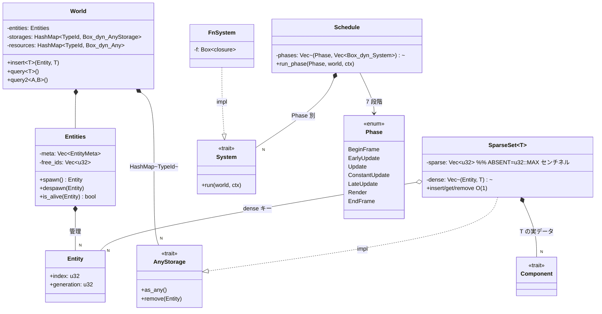
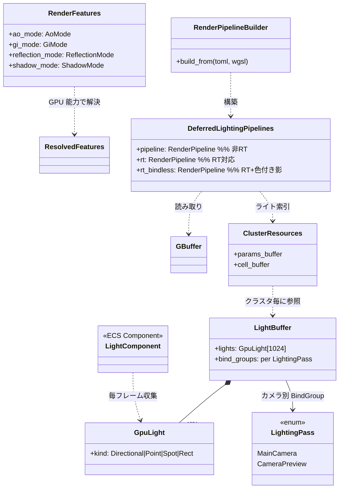
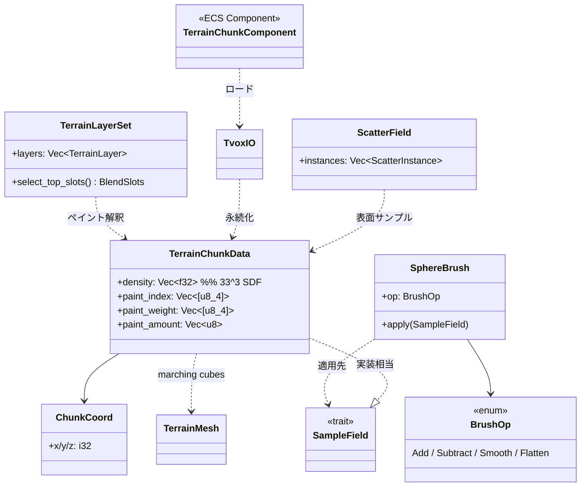
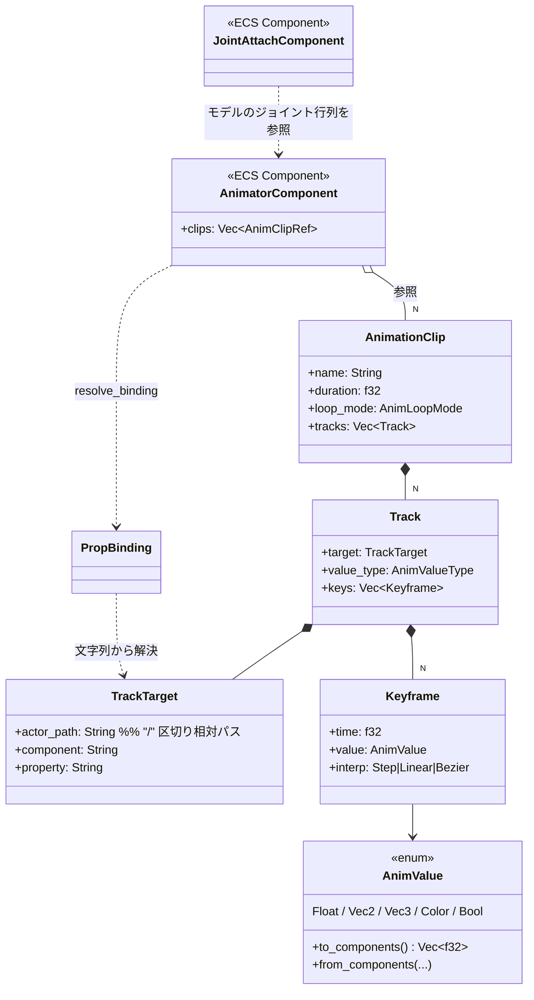
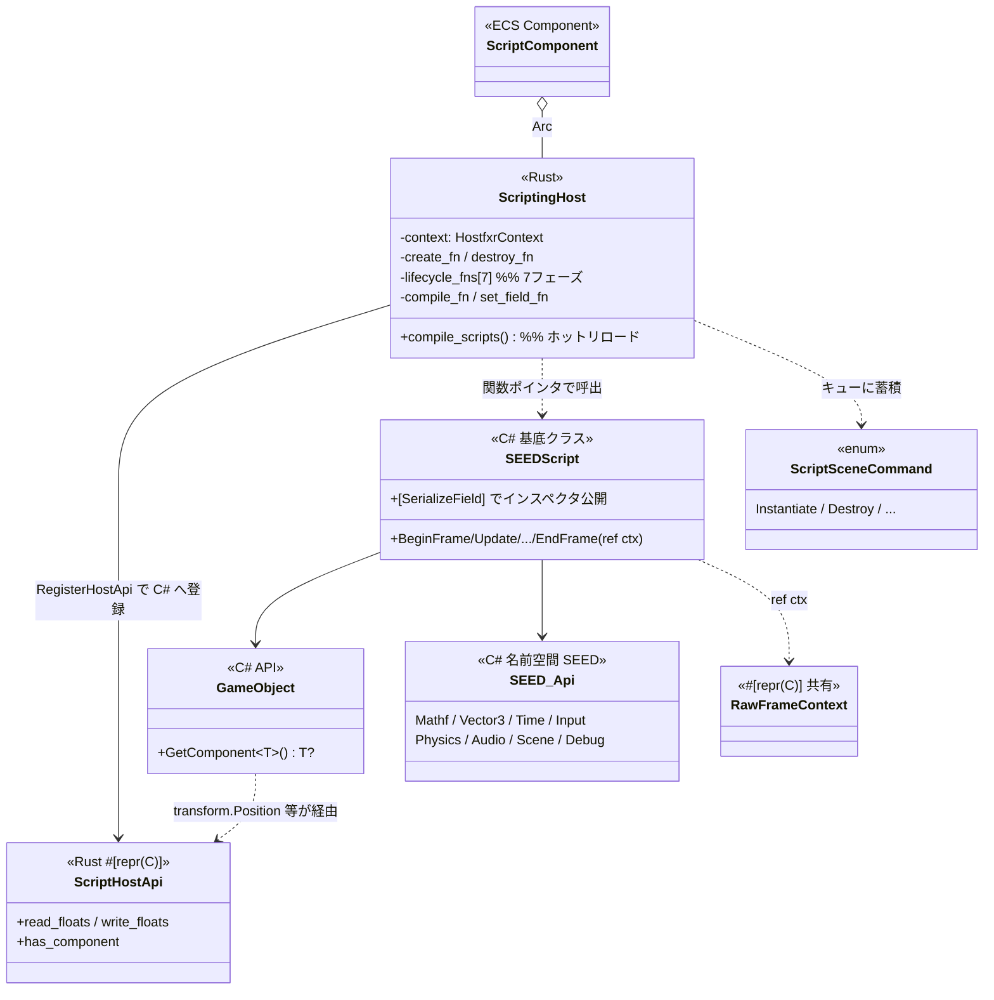
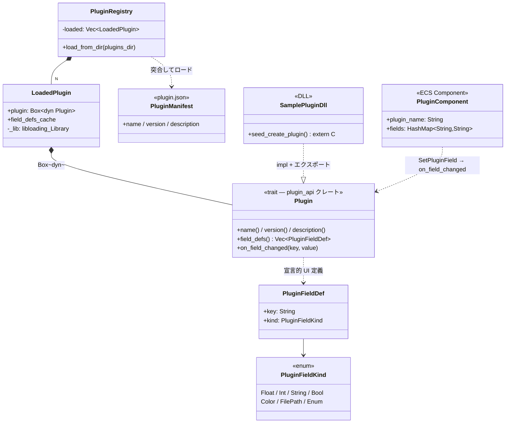
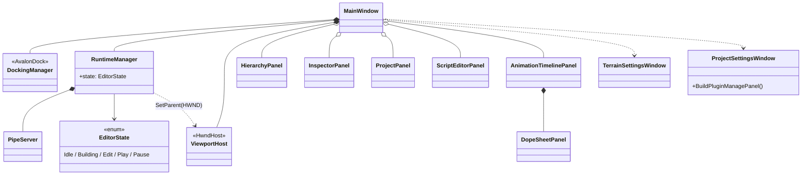
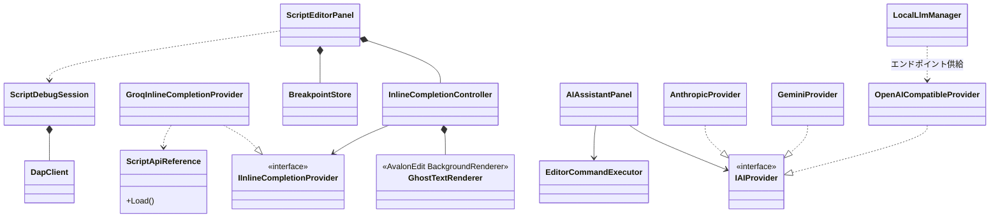
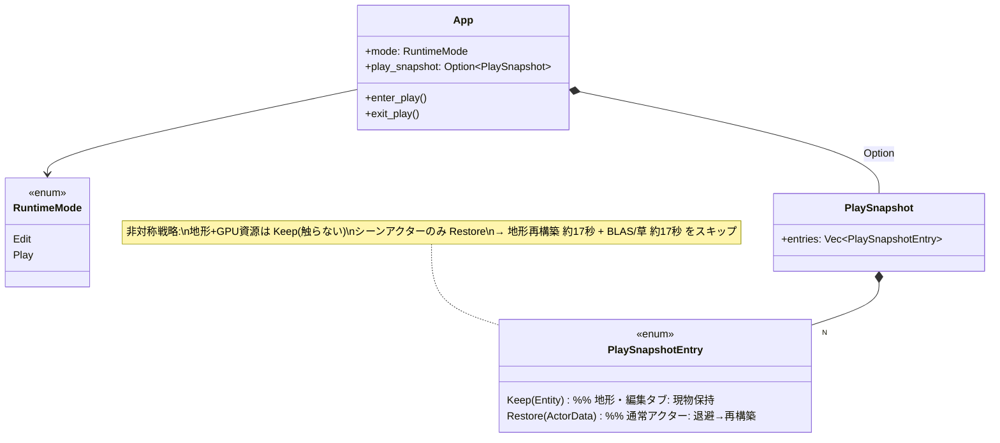

# SEED エンジン — クラス図集（Mermaid）

[architecture_showcase.md](architecture_showcase.md) の補足資料。
主要サブシステムの型関係を Mermaid classDiagram で図示する。
GitHub / VSCode（Mermaid 拡張）でそのままレンダリング可能。

---

## 1. ECS コア（runtime/src/engine/ecs/）

---

## 2. Actor / Scene レイヤ（structs/objects/actor, app_base/scene.rs）

```mermaid
classDiagram
    class Scene {
        +name: String
        +world: World
        +actors: Vec~Actor~
        +schedule: Schedule
    }
    class Actor {
        +entity: Entity
        +name: String
        +world_line: u32  %% タブ別編集空間
        +prefab_source: Option~String~
        +children: Vec~Actor~
        +slots: Vec~ComponentSlot~
        +to_data(world) ActorData
    }
    class ComponentSlot {
        +name: String
        +kind: ComponentKind
        +type_id: TypeId
        +entity: Entity  %% スロット専用エンティティ
        +enabled: bool
    }
    class ActorKind {
        <<enum>>
        Actor3D
        Actor2D
    }
    class ComponentKind {
        <<enum>>
        Model / Script / Camera / Light
        Collider / Audio / Animator / ...
    }
    class ActorData {
        <<serde>>
        +components: Vec~ComponentSlotData~
        +children: Vec~ActorData~
        +prefab_source: Option~String~
    }
    class SceneData {
        <<serde>>
        +name: String
        +actors: Vec~ActorData~
    }

    Scene *-- World
    Scene *-- Schedule
    Scene *-- "N" Actor : ルート DFS 順
    Actor *-- "N" Actor : children（再帰木）
    Actor *-- "N" ComponentSlot
    Actor --> ActorKind
    ComponentSlot --> ComponentKind
    ComponentSlot --> Entity : 実データのキー
    Actor ..> ActorData : to_data / build_actor
    ActorData *-- "N" ActorData : 再帰
    SceneData *-- "N" ActorData
    note for ComponentSlot "スロットごとに専用 Entity を spawn。\n同型コンポーネントの多重アタッチを実現"
```

---

## 3. レンダリング（core/renderer/）

---

## 4. 地形システム（engine/terrain/ — エンジン非依存層）

---

## 5. アニメーション（engine/animation/）

---

## 6. C# スクリプトホスティング（core/scripting/ ⇔ scripting/）

---

## 7. プラグインシステム（plugin_api / engine/plugin/）

---

## 8. WPF エディタ全体（editor/src/）

---

## 9. AI 補完・デバッガ（editor/src/Panels/ScriptEditor/, Debugger/, AI/）

---

## 10. インプレース Play（play_mode_ops.rs）

